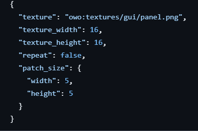

# Surfaces
A "surface" is a texture or mathematical expression used to create the background of a UI element, a common example would be the panel texture commonly used in most mods and the vanilla game for UI. 


Internally, they are a lambda interface that takes 2 variables, a draw-context and a parent component, to perform a action that doesn't return anything. You are expected to use the variables to produce the desired background.

Currently, there is no way to register a custom surface for use in XML files without mixing into OwoLib code, meaning they have to be applied directly in code to your UI components

## Laying Surfaces
In some cases, you may want to use multiple surfaces on the same element at once. This can be performed by layering them on-top of each-other. However, when laying a surface on-top another surface, you must remember that the surface on-top will cover the surface below it.

For example, if we lay a outline surface above a flat surface, the outline will be present, but if we lay a flat surface above a outline surface, the outline will *not* be present

### Code-driven
If applying surfaces in code, you can use the `and(Surface surface)` default method in the Surface interface to lay a second surface on-top of the first surface.

### Data-driven (XML)
If applying surfaces in a xml file, you can use multiple surfaces in a element's `surface` section, like so:
```xml
<surface>
  <flat>gray</flat>
  <outline>black</outline>
</surface>  
```
The bottom surface will be layed on-top of the top surface; in this case, the black outline will be on-top of the gray flat

# Nine-Patch Textures
"Nine-Patch Textures" is an API within OwoLib that dynamically produces, or "draws" a background from a texture and nine-patch json file, by applying "patches" of a texture (a sampled section of the texture)
They are primarily used for drawing textured surfaces in UI created through OwoLib. 




You can draw a Nine-Patch Texture in a surface lambda using the `NinePatchTexture#draw` method, with the identifier pointing to your Nine-Patch json file location (**the identifier MUST contain the name of the file, excluding the ".json" file extension**)


## Nine-Patch Json
The values in a Nine-Patch Texture JSON are as-follows; you are expected to put the file in the directory defined in the identifier (**reminder, the identifier must end with your json file's name**) (*note, you are expected to already know proper JSON syntax when viewing this*):
```
"texture": Your texture location identifier, must contain the texture file name INCLUDING the file-extension,
"texture_width": the full width of your texture file, must be an integer,
"texture_height": the full height of your texture file, must be an integer,
"repeat": should the texture be stretched or repeated across what you're drawing on, boolean,
// the patch size is the size of the patch applied when drawing the surface
"patch_size": {
  "width": the width a patch has to be, must be an integer
  "height": the height a patch has to be, must be an integer
}

// alternatively, you can define the patch size for the corner and centre of a surface separately, like-so
"corner_patch_size": {
  "width": the width a patch used for surface corners has to be, must be an integer
  "height": the height a patch used for surface corners has to be, must be an integer
},
"center_patch_size": {
  "width": the width a patch used for the rest of a surface has to be, must be an integer
  "height": the height a patch used for the rest of a surface has to be, must be an integer
}
```

# Examples
You can find examples of usage of Nine-Patch Textures in the OwoLib GitHub-repository:

Code: [click here](https://github.com/wisp-forest/owo-lib/blob/1.21.6/src/main/java/io/wispforest/owo/ui/core/Surface.java)

Textures: [click here](https://github.com/wisp-forest/owo-lib/tree/1.21.6/src/main/resources/assets/owo/textures/gui)

JSON files: [click here](https://github.com/wisp-forest/owo-lib/tree/1.21.6/src/main/resources/assets/owo/nine_patch_textures)
